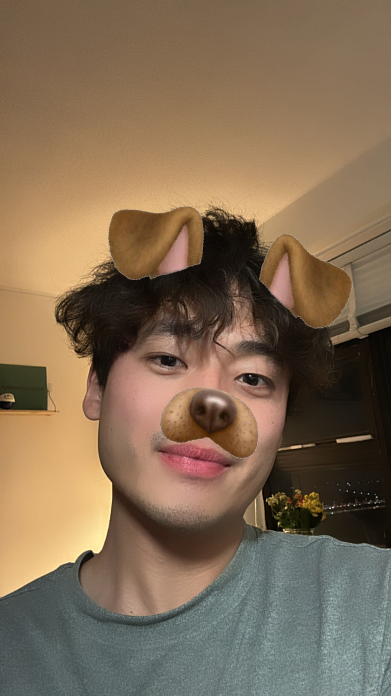

<h1 style="text-align: center; color: #f89cab; font-size: 30px; margin: 40px 0;"> 
Thank you for visiting our project website
</h1>


:::: {style="display: flex; margin-top: 25px"}

::: {.col}

```{r, echo=FALSE, fig.width = 15, fig.align = 'center'}

```

<strong style="text-align: center; display: block; text-align: center;">
[Shiyu Zhang](https://shireen-zsy.github.io/)
</strong>

<em style="text-align: center; display: block; text-align: center;">
Department of Biostatistics<br>
Public Health Data Science
</em>

:::

::: {.col}

```{r, echo=FALSE, fig.width = 15, fig.align = 'center'}

```

<strong style="text-align: center; display: block; text-align: center;">
[Weiqi Liang](https://weiqiliang022.github.io/WL3011/)
</strong>

<em style="text-align: center; display: block; text-align: center;">
Department of Biostatistics<br>
Theory and Methods
</em>

:::

::: {.col}

```{r, echo=FALSE, fig.width = 15, fig.align = 'center'}

```

<strong style="text-align: center; display: block; text-align: center;">
[Zhenkun Fang](https://zhenkunnfang.github.io/)
</strong>

<em style="text-align: center; display: block; text-align: center;">
Department of Biostatistics<br>
Theory and Methods
</em>

:::

::: {.col}

```{r, echo=FALSE, fig.width = 15, fig.align = 'center'}

```

<strong style="text-align: center; display: block; text-align: center;">
Zeqi Li
</strong>

<em style="text-align: center; display: block; text-align: center;">
Department of Biostatistics<br>
Pharmaceutical Statistics
</em>


:::

::::

